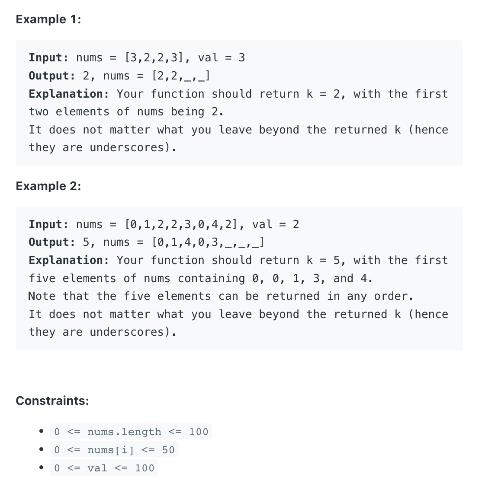

___
[27. Remove Element](https://leetcode.com/problems/remove-element/)
___


## 基本思路
* The key point is when we move left pointer.
* If current element == val, we don't move left pointer and move to next element (right++)
* If current element != val, we override `nums[left]` == `nums[right]` and then move left pointer.

___

`Time complexity : O(n)`

`Space complexity : O(1)`
```python
class Solution:
    def removeElement(self, nums: List[int], val: int) -> int:
        left = right = 0
        
        while right < len(nums):
            if nums[right] != val:
                nums[left] = nums[right]
                left += 1
            right += 1
        return left
                
```