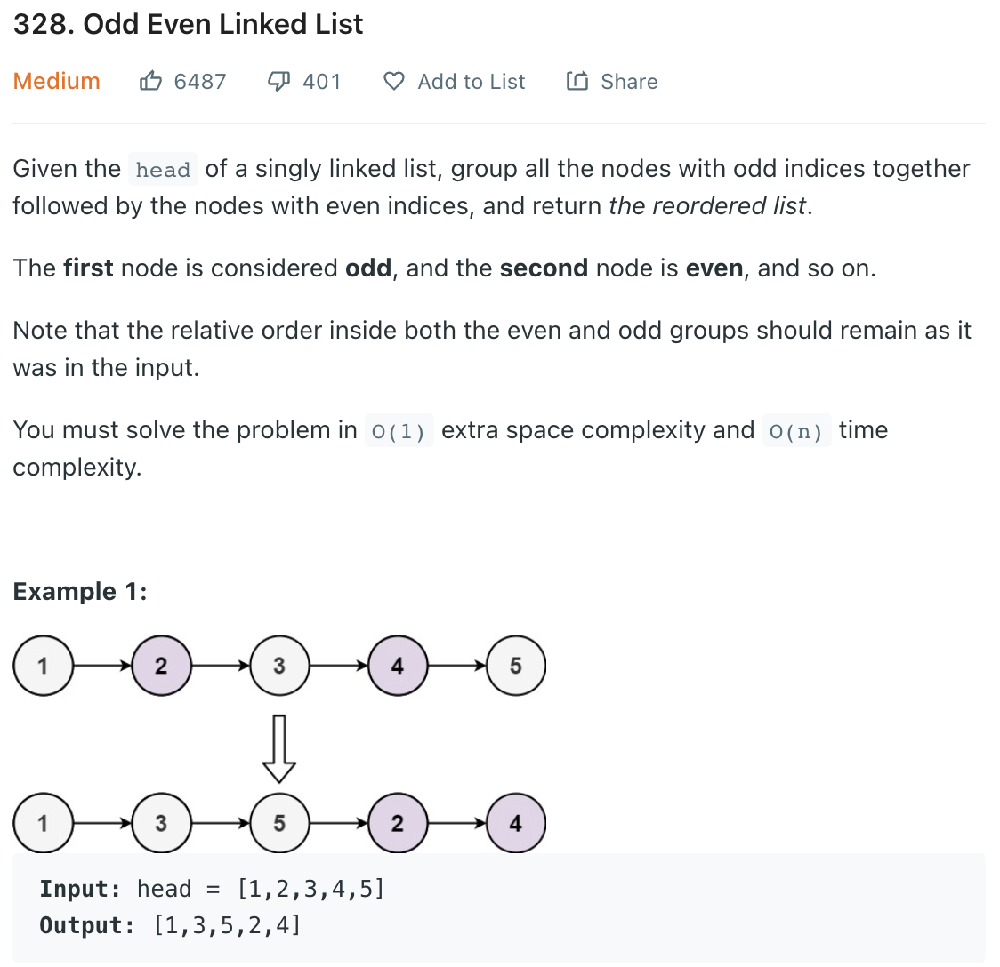

___
[328. Odd Even Linked List](https://leetcode.com/problems/odd-even-linked-list/)
___


## 基本思路
* Straight forward two pointer quesiton.
* Draw 

___

`Time complexity : O(n)`

`Space complexity : O(1)`
```java
class Solution {
    public ListNode oddEvenList(ListNode head) {
        if (head == null) {
            return null;
        }
        ListNode dummy = new ListNode();
        dummy.next = head;
        ListNode first = dummy.next;
        ListNode secondDummy = first.next;
        ListNode second = first.next;
        
        while (second != null && second.next != null) {
            first.next = second.next;
            first = first.next;
            second.next = first.next;
            second = second.next;
        }
        
        first.next = secondDummy;
        
        return dummy.next;
    }
}
```