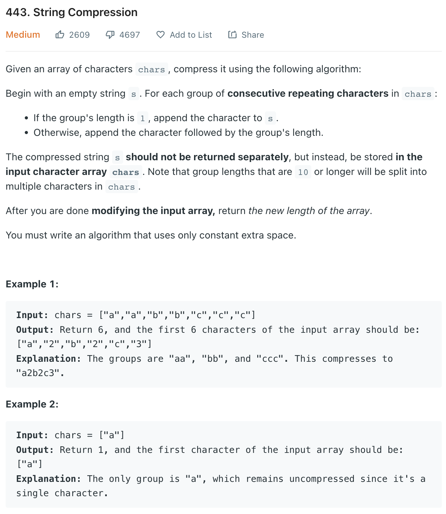

___
[443. String Compression](https://leetcode.com/problems/string-compression/)
___


## 基本思路
* This is a sucked Two Pointer question
* Normal two pointer, but need to check the `currentLength`.
* If the `currentLength` is 1, we do nothing

___

`Time complexity : O(n)`

`Space complexity : O(1)`
```python
class Solution:
    def compress(self, chars: List[str]) -> int:
        left = right = 0
        while right < len(chars):
            currentChar = chars[right]
            currentLength = 0
            while right < len(chars) and currentChar == chars[right]:
                right += 1
                currentLength += 1
            
            chars[left] = currentChar
            left += 1
            if currentLength > 1:
                strLength = str(currentLength)
                for c in strLength:
                    chars[left] = c
                    left += 1
                    
        return left
```