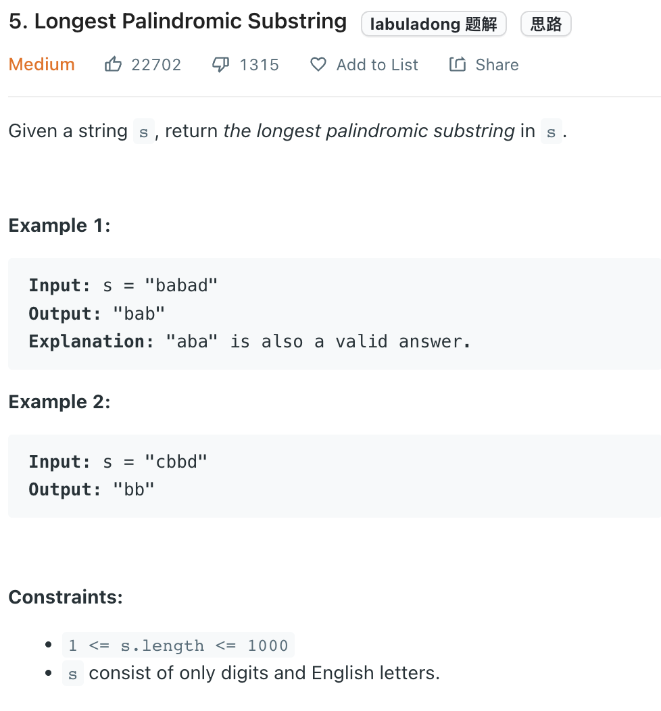

___
[5. Longest Palindromic Substring](https://leetcode.com/problems/longest-palindromic-substring/)
___

## 基本思路
* Expand from center

___

`Time complexity : O(n^2)`

`Space complexity : O(1)`
```python
class Solution:
    def longestPalindrome(self, s: str) -> str:
        length = len(s)
        def expandWindow(left, right):
            while left >= 0 and right < length and s[left] == s[right]:
                left -= 1
                right += 1
            return ''.join(s[left + 1: right])
            
        answer = ''
        
        for i in range(length):
            oddLength = expandWindow(i, i)
            evenLength = expandWindow(i, i + 1)
            answer = oddLength if len(oddLength) > len(answer) else answer
            answer = evenLength if len(evenLength) > len(answer) else answer
            
        return answer
```