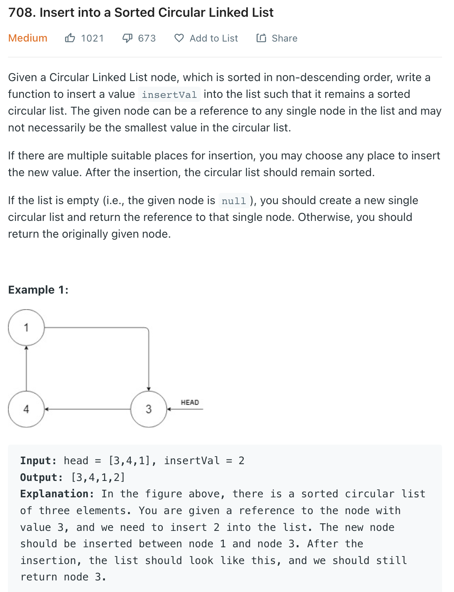
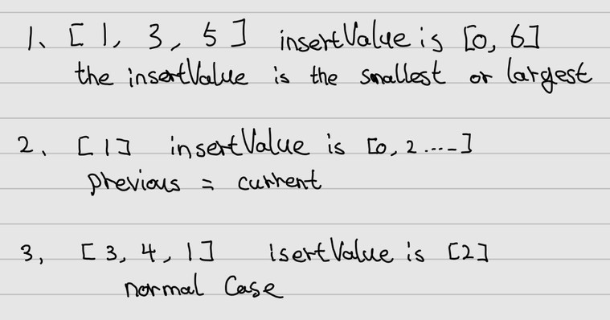

___
[708. Insert into a Sorted Circular Linked List](https://leetcode.com/problems/insert-into-a-sorted-circular-linked-list/)
___


## 基本思路
* initially, i think this is an easy question, but there are few cases you need to take care

* 1 normal case and 2 edge cases
___

`Time complexity : O(n)`

`Space complexity : O(1)`

```python
"""
# Definition for a Node.
class Node:
    def __init__(self, val=None, next=None):
        self.val = val
        self.next = next
"""

class Solution:
    def insert(self, head: 'Optional[Node]', insertVal: int) -> 'Node':
        if not head:
            node = Node(insertVal)
            node.next = node
            return node
        
        dummy = Node(-1, head)
        previous = dummy.next
        current = previous.next
        
        while True:
            if previous.val <= insertVal <= current.val:
                previous.next = Node(insertVal, current)
                return dummy.next
            elif previous.val > current.val:
                if insertVal >= previous.val or insertVal <= current.val:
                    previous.next = Node(insertVal, current)
                    return dummy.next 
            previous = current
            current = current.next
            if previous == head:
                break
        
        previous.next = Node(insertVal, current)
        return dummy.next
```