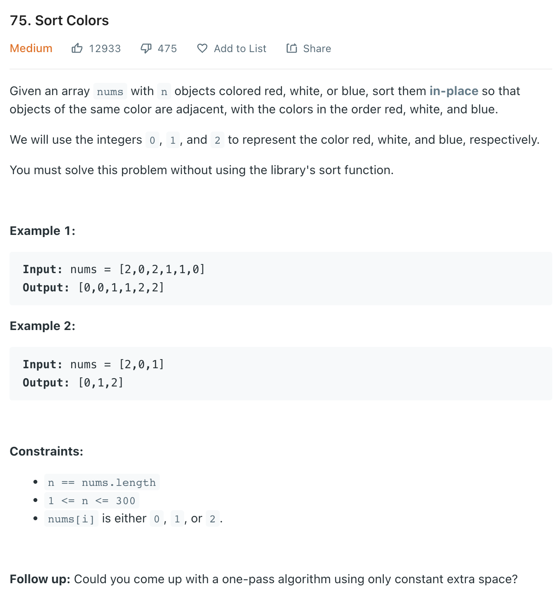
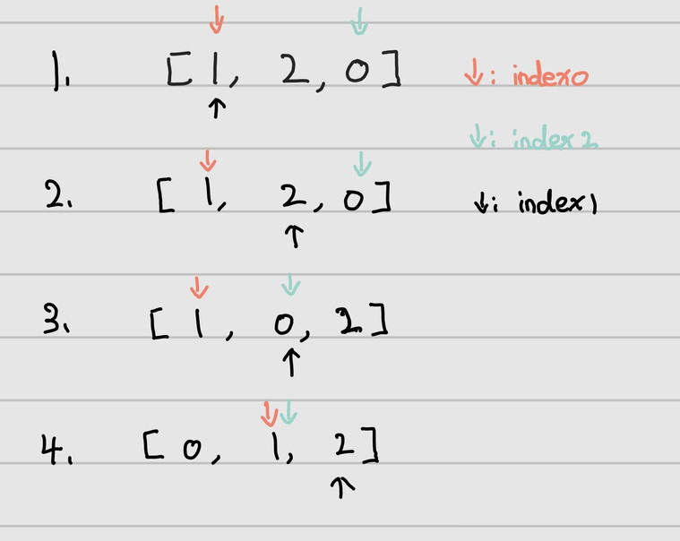

___
[75. Sort Colors](https://leetcode.com/problems/sort-colors/)
___

## 基本思路
* The easiest way of sloving this question is count `numOfZeros`, `numOfOnes`, `numOfTwos`.
* Then have 3 for loop to override the nums.

* Another 1 pass way of solving this question is Three Pointers.
* We have `index0`, `index1`, `index2`, which repersents the correct position of num 0, 1, 2.
* If we meet 0, we swap with `index1` and `index0++`
* If we meet 2, we swap with `index1` and `index2--`
* The key point of this question is when do `index1++`
* Do we do `index1++` every loop or? 

___

`Time complexity : O(n)`

`Space complexity : O(1)`
```python
class Solution:
    def sortColors(self, nums: List[int]) -> None:
        """
        Do not return anything, modify nums in-place instead.
        """
        
        length = len(nums)
        
        index0, index1, index2 = 0, 0, length - 1
        
        while index1 <= index2:
            if nums[index1] == 0:
                nums[index0], nums[index1] = nums[index1], nums[index0]
                index0 += 1
                index1 += 1
            elif nums[index1] == 2:
                nums[index2], nums[index1] = nums[index1], nums[index2]
                index2 -= 1
            else:
                index1 += 1
```