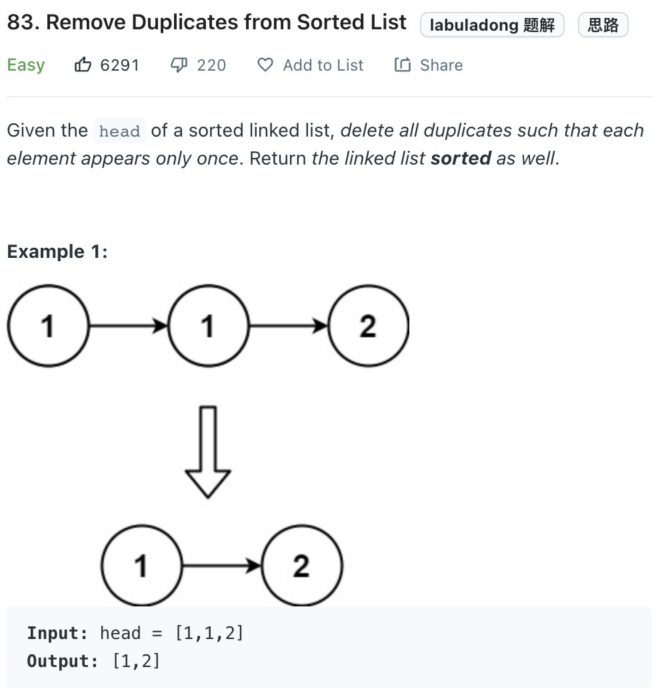

___
[83. Remove Duplicates from Sorted List](https://leetcode.com/problems/remove-duplicates-from-sorted-list/)
___


## 基本思路
* Slow and Fast pointer

___

`Time complexity : O(n)`

`Space complexity : O(1)`
```python
class Solution:
    def deleteDuplicates(self, head: Optional[ListNode]) -> Optional[ListNode]:
        if not head:
            return None
        dummy = ListNode()
        dummy.next = head
        slow = head
        fast = head
        
        while fast:
            if fast.val != slow.val:
                slow.next = fast
                slow = slow.next
            fast = fast.next
        
        slow.next = None
        return dummy.next
```