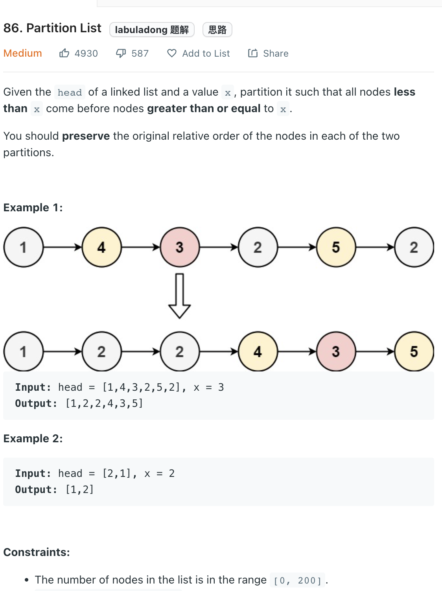

___
[86. Partition List](https://leetcode.com/problems/partition-list/)
___

## 分析问题
* We can use two pointers and swap the node. ( quicksort's partition logic)
* But it's really hard to maintain the order of the list

## 基本思路
* We need to break this list into two.
* `first` list is all nodes that smaller than `x`
* `second` list is all nodes that >= than `x`
* And combine two list into one

___

`Time complexity : O(n)`

`Space complexity : O(1)`
```java
    public ListNode partition(ListNode head, int x) {
        ListNode dummy_first = new ListNode(0);
        ListNode first = dummy_first;
        ListNode dummy_second = new ListNode(0);
        ListNode second = dummy_second;
        
        while (head != null) {
            if (head.val < x) {
                first.next = head;
                first = first.next;
            } else {
                second.next = head;
                second = second.next;
            }
            head = head.next;
        }
        second.next = null;
        first.next = dummy_second.next;
        
        return dummy_first.next;
    }
```