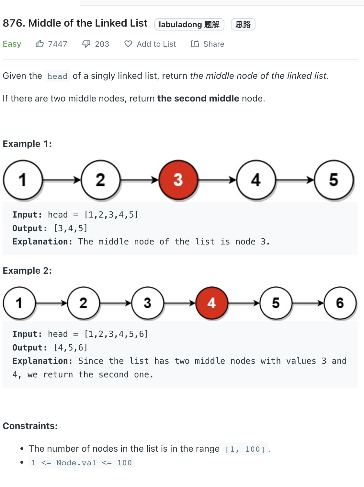

___
[876. Middle of the Linked List](https://leetcode.com/problems/middle-of-the-linked-list/)
___


## 基本思路
* check out this question [141. Linked List Cycle](https://github.com/longlonglu/shuati/blob/main/two_pointers/141.%20Linked%20List%20Cycle/141.%20Linked%20List%20Cycle.md)

___

`Time complexity : O(n)`

`Space complexity : O()`
```python
    def middleNode(self, head: Optional[ListNode]) -> Optional[ListNode]:
        slow = head
        fast = head
        
        while fast and fast.next:
            slow = slow.next
            fast = fast.next.next
            
        return slow
```