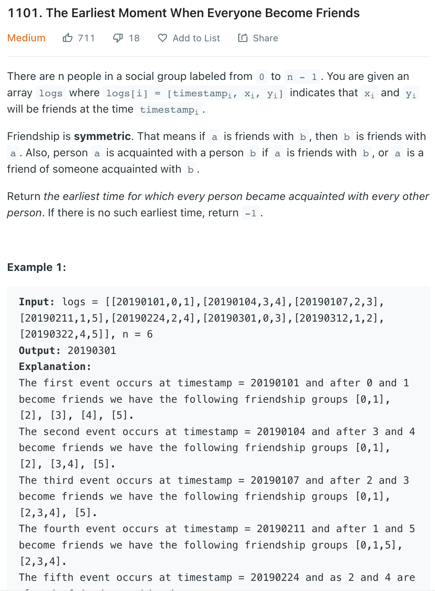

___
[1101. The Earliest Moment When Everyone Become Friends](https://leetcode.com/problems/the-earliest-moment-when-everyone-become-friends/)
___


## 基本思路
* This is an union-find question.
* Initially, we have `n` groups. we have `n` people and no one knows each other.
* If we want to `union (personA, personB)`, we first find `personA's group(parent)` and `personB's group(parent)`.
* If they already in the same group(have same parent), we know we don't need to merge. 
* The rank is just an optimize solution. We have decide to not use it.

___

`Time complexity : O()`

`Space complexity : O()`
```java
class Solution {
    public int earliestAcq(int[][] logs, int n) {
        Arrays.sort(logs, new Comparator<int[]>() {
            @Override
            public int compare(int[] log1, int[] log2) {
                return log1[0] - log2[0];
            }
        });
        UnionFind uf = new UnionFind(n);
        for (int[] log: logs) {
            int time = log[0];
            int a = log[1];
            int b = log[2];
            if (uf.union(a, b)) {
                n -= 1;
            }
            if (n == 1) {
                return time;
            }
        }
        return -1;
    }
}

class UnionFind {
    int[] group; // index is the person itself, value is the parent (connected)
    int[] rank;
    
    public UnionFind(int totalPersons) {
        this.group = new int[totalPersons];
        this.rank = new int[totalPersons];
        for (int person = 0; person < totalPersons; person++) {
            group[person] = person;
            rank[person] = 0;
        }
    }
    
    public int find(int person) {
        if (group[person] != person) {
            group[person] = find(group[person]);
        }
        return group[person];
    }
    
    public boolean union(int a, int b) {
        int groupA = find(a);
        int groupB = find(b);
        
        if (groupA == groupB) {
            return false;
        }
        if (rank[groupA] > rank[groupB]) {
            group[groupB] = groupA;
        } else if (rank[groupA] < rank[groupB]) {
            group[groupA] = groupB;
        } else {
            group[groupA] = groupB;
            rank[groupB] += 1;
        }
        return true;
    }
}
```