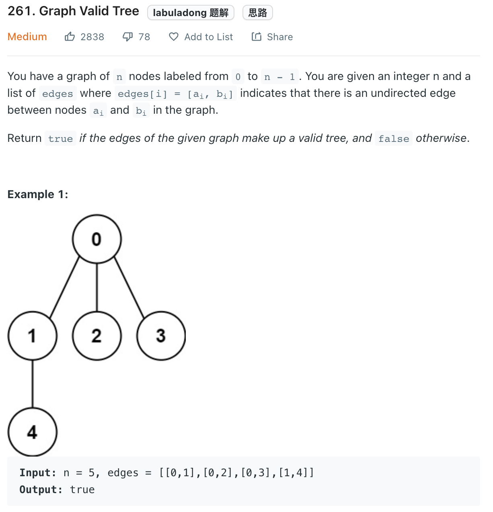

___
[261. Graph Valid Tree](https://leetcode.com/problems/graph-valid-tree/)
___


## 基本思路
* Union Find.
* If we can merge all node into a single root. That means a valid tree.
* If after merged, we have 2 roots, then invalid.
* If while merging, we see two different nodes are pointing to the same root, then invalid.
___

`Time complexity : O(n)`

`Space complexity : O(n)`
```java
class Solution {
    public boolean validTree(int n, int[][] edges) {
        int length = edges.length;
        
        UnionFind uf = new UnionFind(n);
        for (int[] edge: edges) {
            int nodeA = edge[0];
            int nodeB = edge[1];
            if (!uf.union(nodeA, nodeB)) {
                return false;
            }
        }
        return uf.totalTrees == 1;
    }
}

class UnionFind {
    int[] parent;
    int[] rank;
    int totalTrees;
    
    public UnionFind(int n) {
        parent = new int[n];
        rank = new int[n];
        totalTrees = n;
        for (int i = 0; i < n; i++) {
            parent[i] = i;
            rank[i] = 1;
        }
    }
    
    public int findParent(int node) {
        while (parent[node] != node) {
            parent[node] = parent[parent[node]];
            node = parent[node];
        }
        return node;
    }
    
    public boolean union(int nodeA, int nodeB) {
        int rootA = findParent(nodeA);
        int rootB = findParent(nodeB);
        if (rootA == rootB) {
            return false;
        }
        
        if (rank[rootA] < rank[rootB]) {
            parent[rootA] = rootB;
            rank[rootB] += rank[rootA];
        } else {
            parent[rootB] = rootA;
            rank[rootA] += rank[rootB];
        }
        totalTrees--;
        return true;
    }
}
```